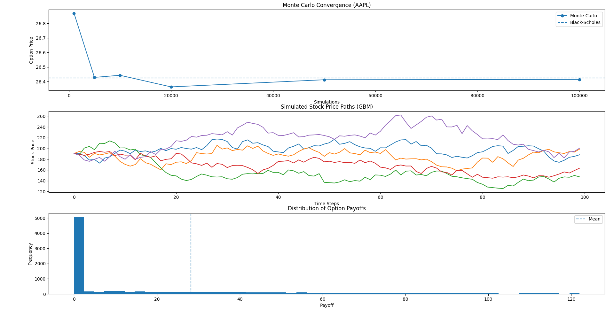

# Monte Carlo Option Pricing (Real Data)

## Overview
This project implements Monte Carlo simulation to price European call options using real market data. It compares results with the Black-Scholes model and includes convergence and payoff analysis.

## Features
- Monte Carlo option pricing
- Black-Scholes comparison
- Convergence analysis
- GBM stock price simulation
- Payoff distribution
- Real market data (Yahoo Finance)

## Tech Stack
- Python
- NumPy
- Matplotlib
- SciPy
- yFinance

## How it Works
1. Fetch stock data using yFinance
2. Calculate volatility from returns
3. Simulate stock prices (GBM)
4. Compute option payoffs
5. Compare with Black-Scholes

## Run the Project
```bash
pip install -r requirements.txt
python main.py

## Example Output


